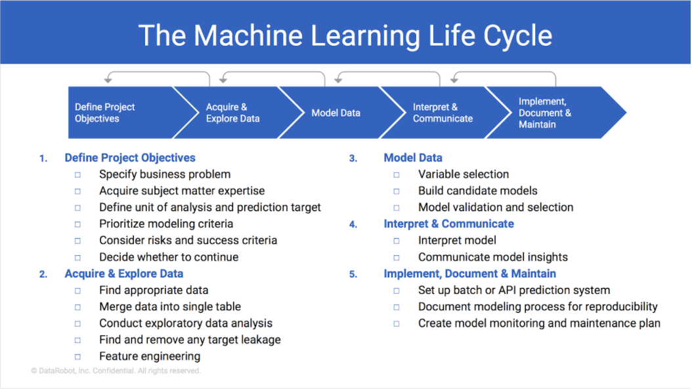
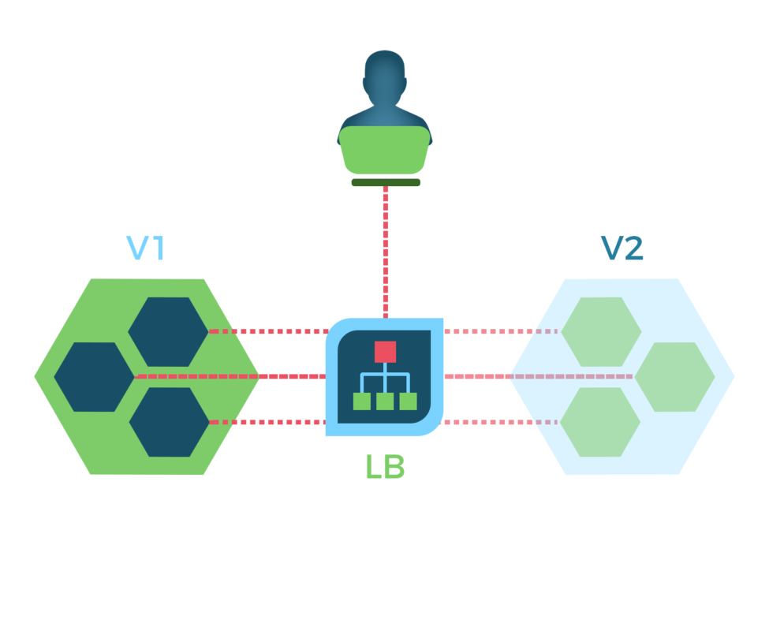
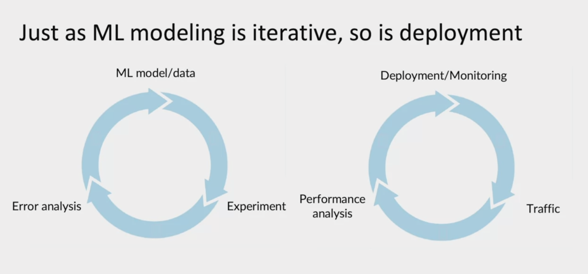
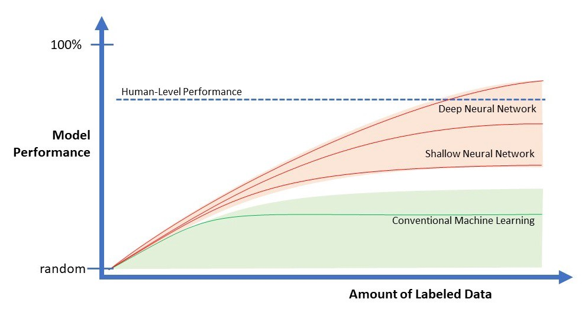
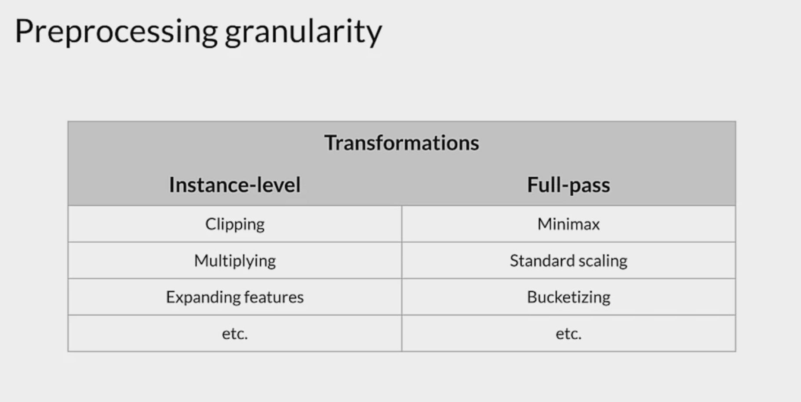
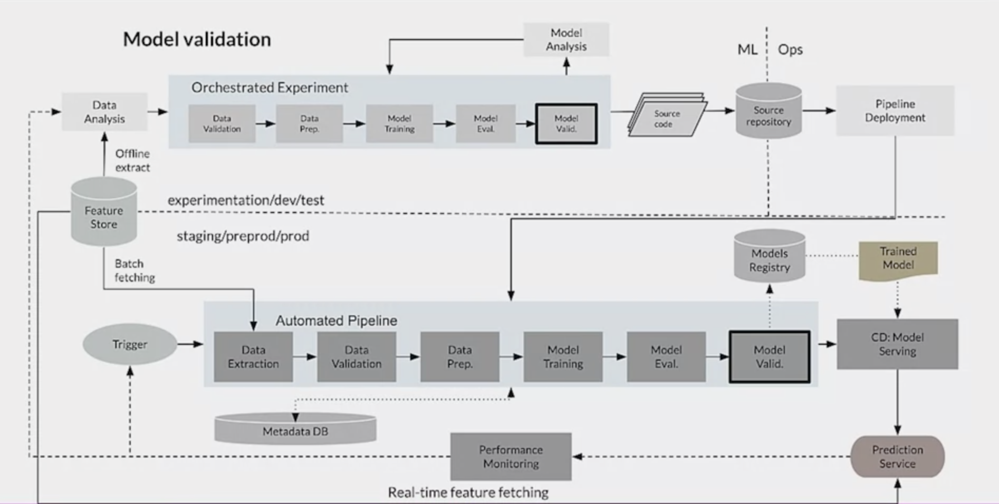

# Machine Learning Engineering for Production (MLOps) Specialization

## Description
I am fascinated by what goes into building and deploying models such as ChatGPT and Github Copilot, which are not only successful but have improved my life immeasurably. This repository follows along with the MLOps Specialization in Coursera to learn from the world's best how to build and deploy models in production.

## Tips on learning
It could be quite boring and difficult to learn online when there are no teachers or students to push you, especially doing an advanced course like this. Here are some tips that I found useful:
1. Set a tiny goal, such as completing one week. Forget about the rest since it is too overwhelming.
2. When listening to the lecture, try picturing what is being taught. This makes it more fun and helps retention, and can be done whether you take notes or not.

Over time the tiny goals add up to completion and the imagery will result in surprising recollection of the material.

## Course structure
1. Introduction to Machine Learning in Production
2. Machine Learning Data Lifecycle in Production
3. Machine Learning Modeling Pipeline in Production
4. Deploying Machine Learning Models in Production

## Course 1: Introduction to Machine Learning in Production
### Week 1: Overview of the ML Lifecycle and Deployment

__MACHINE LEARNING PROJECT LIFECYCLE__



While developing machine learning models can be a complex and challenging task, it is only a small part of the work involved in bringing a machine learning project to production. In fact, the model itself typically accounts for only 5-10% of the entire project. The rest of the work involves tasks such as preparing and cleaning the data, setting up and maintaining the infrastructure to train and deploy the model, and building the software that integrates the model into a larger system. This often requires significant software development work, such as designing APIs, implementing security and privacy controls, and handling various edge cases. As a result, building and deploying machine-learning systems in production requires a combination of machine-learning expertise and software engineering skills. Many people in the machine learning community may not be aware of this, leading to a misconception that the field is primarily about building models and not about the broader engineering work involved in bringing those models to production.


The lifecycle of a machine learning model is a process that involves the following steps:
1. Scoping: The first step in any machine learning project is to scope out the problem and determine whether a machine learning approach is appropriate for solving it. This might involve conducting research, gathering data, and identifying potential challenges or limitations.
2. Data: The next step is to explore and preprocess the data to make it suitable for use in your machine-learning model. This might involve cleaning, transforming, and normalizing the data, and performing any necessary feature engineering.
3. Modeling: Once the data is ready, you will need to select and evaluate the appropriate machine-learning model for your problem. This might involve experimenting with different algorithms, hyperparameters, and techniques to find the best model for your data.
4. Deployment: Finally, you will need to deploy the model in a production environment, where it can be used to make predictions and solve problems. This will also involve ongoing maintenance and monitoring of the model, to ensure that it continues to perform well and to identify any potential issues or improvements.

__DEPLOYMENT__

One of the key challenges in deploying machine learning models is concept drift, which occurs when the underlying distribution of the data changes over time. This can lead to a decline in the performance of the model, as it is no longer able to make accurate predictions on the new data. Another related challenge is data drift, which occurs when there are changes in the quality or format of the data being used to train the model. This can also impact the performance of the model and make it less effective at making predictions. Both concept drift and data drift can be difficult to detect and manage, and they require ongoing monitoring and retraining of the model to ensure it remains accurate and effective.

There are a number of key challenges to consider when deploying machine learning models, including:
1. Realtime or batch: One challenge is deciding whether to use a real-time or batch-based approach for deploying the model. Realtime deployment allows the model to make predictions as new data becomes available, while batch deployment involves processing data in larger chunks at regular intervals.
2. Cloud vs Edge/Browser: Another challenge is deciding whether to deploy the model in the cloud or on edge devices or in a web browser. Deploying in the cloud allows for easier scalability and access to more compute resources, but it can also result in higher latency and increased data transfer costs. Deploying on-edge devices or in a web browser can reduce latency and improve privacy, but it may also require more complex infrastructure and management.
3. Compute Resources (CPU/GPU/Memory): Choosing the right to compute resources for deploying the model is also critical. The type and amount of CPU, GPU, and memory available will impact the performance of the model and its ability to make predictions in real-time or batch mode.
2. Latency/Throughput: The latency and throughput of the model are also important considerations. Latency refers to the time it takes for the model to make a prediction, while throughput refers to the number of predictions the model can make per second. Both latency and throughput can impact the user experience and the overall performance of the model.
3. Logging: Logging is an essential part of deploying machine learning models, as it allows for tracking and monitoring of the model's performance and accuracy over time. Proper logging can also help with troubleshooting and debugging any issues that may arise.
4. Security and Privacy: Ensuring the security and privacy of the data being used to train and evaluate the model is also a key challenge. This can involve implementing encryption and other security measures to protect the data, as well as complying with relevant laws and regulations.



Shadow mode, canary, and blue-green are deployment strategies that are often used in the context of machine learning.

Shadow mode involves deploying a machine learning model alongside the existing model in production, but not using it to serve predictions to users. Instead, the shadow model generates predictions in the background, and these predictions are compared with the predictions of the existing model. This allows the performance of the new model to be evaluated without disrupting the user experience.

Canary deployment involves deploying a new machine-learning model to a subset of users, while the existing model continues to serve the majority of users. This allows the performance of the new model to be evaluated on a smaller scale before it is rolled out to all users.

Blue-green deployment involves deploying a new machine-learning model alongside the existing model but routing a portion of the incoming requests to the new model. This allows for a seamless transition from the old model to the new one, as the two models can be compared and the performance of the new model can be evaluated before it is used to serve all predictions.

__Automation__

The degree of automation refers to the extent to which the deployment process is automated. Different levels of automation can be applied to the deployment process, ranging from fully manual to fully automatic.

At the lowest level of automation, the deployment process is completely manual and requires manual intervention at every step. This can be time-consuming and error-prone, and it is not suitable for deploying machine learning models in production environments.

At the next level of automation, some steps in the deployment process are automated, while others are performed manually. This can include automated testing and deployment of the machine learning model, but manual steps may be required to configure the model and set up the deployment environment.

At the highest level of automation, the entire deployment process is fully automated, from model training and testing to deployment and monitoring. This allows for rapid and efficient deployment of machine learning models, with minimal manual intervention. This is often the preferred approach for deploying machine learning models in production environments.

__Monitoring and Maintenance__



Model maintenance is the process of keeping a machine learning model up to date and performing well over time. This can involve several different activities, including monitoring the model's performance, retraining the model on new data, and adjusting the model's hyperparameters to improve its performance. It is important to perform regular model maintenance to ensure that the model continues to make accurate predictions and adapt to changes in the data over time. Additionally, model maintenance can help to prevent overfitting, where the model performs well on the training data but poorly on new data.

### Week 2: Select and Train a Model

__Modeling__

In machine learning, the ultimate goal is to develop a model that not only performs well on the test set but also solves the business problem at hand. This is because the purpose of machine learning is to develop models that can be used to make predictions or take actions in real-world situations. If a model only performs well on the test set but does not solve the business problem, it is not useful in practice and will not provide any value to the business. Therefore, it is important to choose a model that not only performs well on the test set but also can solve a business problem and provide value in real-world situations.

__Baseline__

Measuring human-level performance is crucial when comparing a machine-learning model to a human benchmark because it enables us to see how well the model is performing compared to a known standard. This helps us identify areas where the model is outperforming or underperforming compared to human performance and guides us in determining where to focus our attention and efforts. By comparing the model to human-level performance, we can gain a better understanding of the model's capabilities and limitations, and determine whether it is achieving the desired level of accuracy and performance.

__Precision, Recall, and F1__

In a machine-learning context, precision and recall are two metrics that are used to evaluate the performance of a classifier. Precision is a measure of the fraction of correct positive predictions, and is calculated using the formula:

    Precision = True Positives / (True Positives + False Positives)

Recall, on the other hand, is a measure of the fraction of positive cases that are correctly predicted, and is calculated using the formula:

    Recall = True Positives / (True Positives + False Negatives)

In other words, precision is a measure of the accuracy of the classifier's positive predictions, while recall is a measure of its ability to identify all of the positive cases in the data. Together, these two metrics can provide a more complete picture of a classifier's performance than either one alone

The F1 score is a measure that combines precision and recall into a single metric. It is calculated using the harmonic mean of precision and recall, which is defined as:
    
    F1 = 2 * (Precision * Recall) / (Precision + Recall)

The F1 score is a useful metric because it takes into account both the classifier's precision and recall, and provides a balance between the two. It is particularly useful in cases where you want to avoid either under-prediction or over-prediction of the positive class. For example, in a medical diagnostic setting, a high F1 score would indicate that the classifier has both high precision (i.e. it makes very few false positive predictions) and high recall (i.e. it correctly identifies most of the positive cases).

__Data-centric vs. Model-centric__

The terms data-centric and model-centric refer to two different approaches to AI development. Data-centric AI development focuses on the data that is used to train and evaluate the performance of machine learning models. This approach emphasizes the importance of using large, diverse, and high-quality datasets to train and evaluate machine learning models.

On the other hand, model-centric AI development focuses on machine-learning algorithms and models themselves. This approach emphasizes the importance of developing novel, state-of-the-art machine learning algorithms and models and using them to make predictions or decisions based on data.

One advantage of data-centric AI development is that it allows for the use of large, diverse, and high-quality datasets to train and evaluate machine learning models. This can help to improve the accuracy and reliability of the predictions or decisions made by the models, as well as to reduce the risk of bias or overfitting.

Another advantage of data-centric AI development is that it allows for the use of transfer learning, which is a technique that enables machine learning models to be trained on a large dataset and then fine-tuned on a smaller, specialized dataset. This can save time and resources, and allow for the development of more effective and efficient machine-learning models.

Overall, data-centric AI development can be more advantageous than model-centric AI development because it allows for the use of large, diverse, and high-quality datasets to train and evaluate machine learning models, which can improve the accuracy and reliability of the predictions or decisions made by the models.

__Data Augmentation__

Data augmentation is a technique used to artificially increase the size of a dataset by generating additional data points based on the existing data. This is typically done by applying various transformations to the existing data, such as rotating, scaling, or cropping images, or by adding random noise or perturbations to the data.

The goal of data augmentation is to improve the performance of machine learning models by providing them with more diverse and robust training data. This can help to reduce overfitting, improve generalization, and make the models more robust to changes in the data distribution.

Data augmentation is often used in the context of image classification and object detection, where it can be used to generate additional training data by applying various transformations to the existing images. This can help to improve the performance of the models by making them more robust to changes in the orientation, scale, or lighting of the images.

Overall, data augmentation is a useful technique for increasing the size and diversity of a dataset, which can help to improve the performance of machine learning models.

__Experiment Tracking__

Experiment tracking is the process of keeping track of the different experiments that you run in your machine learning development and the results that they produce. This can be useful for several reasons, including:

- Comparing the results of different experiments to see which approach worked best
- Identifying trends and patterns in your results, which can help you improve your models over time
- Reproducing your experiments in the future, for example, to confirm your results or to share your work with others


To track your experiments effectively, it's important to track the following information:

- The details of your experiments, including the code that you used, the hyperparameters that you chose, and the results that you obtained
- The specific changes that you made to your code and your model so that you can easily reproduce your experiments in the future
- The inputs and outputs of your experiments, including the datasets that you used, the models that you trained, and the predictions that they made
- Any additional information that might be relevant to your experiments, such as the hardware that you used, the runtime that your experiments took, and any notes or observations that you made


There are a few different tools that you can use to track your experiments, including:

- Machine learning frameworks or platforms that provide built-in support for experiment tracking, such as TensorFlow or PyTorch
- Dedicated experiment tracking tools, such as Weights & Biases or Comet.ml, can help you organize and analyze your experiments
- Version control systems, such as Git, can help you track the code and other artifacts associated with your experiments


When choosing a tool to track your experiments, you should look for the following features:

- Automated logging of experiment details, including code, hyperparameters, and results
Visualization and analysis capabilities, such as graphs, charts, and tables, to help you understand your results
- Integration with other tools, such as machine learning frameworks and version control systems, to make it easy to use
- Collaboration and sharing features, such as the ability to share your experiments with others, or to work on them together
- Scalability and flexibility, support a large number of experiments and accommodate different types of data and models.

### Week 3: Data Definition and Baseline

__Unstructured and Structured Data__
Unstructured data is data that does not have a pre-defined structure or format, making it difficult to process and analyze using traditional data management tools. Examples of unstructured data include text documents, audio and video files, and social media posts. In contrast, structured data is data that is organized into a pre-defined format or schema, making it easier to process and analyze. Examples of structured data include database records, spreadsheets, and CSV files.

In general, humans are better at labeling unstructured data than structured data, as unstructured data often contains more complex and nuanced information that is difficult for machines to understand. For example, a human might be able to accurately label the sentiment of a written review, but a machine might struggle to do so. On the other hand, structured data is often easier for machines to process, as it is organized in a way that is more predictable and consistent. This can make it easier for machines to automatically label and analyze structured data.

__Small Data and Big Data__

Small data and big data are terms used to describe the size and complexity of data sets. Small data sets are relatively small and can be easily managed and analyzed using standard data management and analysis tools, while big data sets are so large and complex that they require specialized tools and techniques in order to be processed and analyzed effectively. The main difference between small data and big data is the size and complexity of the data sets involved, which can affect how the data is managed and analyzed. Small data sets are more manageable and easier to analyze, while big data sets require specialized tools and techniques to process and analyze effectively.

__Label Consistency__

Label consistency in machine learning refers to the idea that the labels assigned to data points should be consistent and correct in order for the machine learning model to be effective. This means that the labels should be accurately applied to the data, and should not be conflicting or inconsistent in any way. Ensuring label consistency is important because if the labels are incorrect or inconsistent, the machine learning model will not be able to learn effectively and will not be able to make accurate predictions. This can lead to poor performance and potentially even incorrect or harmful decisions made by the model.

__Human Level Performance__



HLP, or human-level performance, refers to the ability of a machine-learning model to perform at the same level as a human. This is often considered the ultimate goal of many machine learning projects, as achieving human-level performance would mean that the model can perform tasks that require human-like intelligence and reasoning. To achieve HLP, machine learning models typically require a large amount of high-quality training data and powerful computational resources. Additionally, the development process often involves iterative testing and refining of the model to improve its performance.

Although, as Andrew mentioned, it is not necessary to achieve HLP to build a useful machine-learning model.

__Meta-data, Data Provenance, and Data Lineage__

Meta-data is information that describes other data. It can include things like the date a file was created, the author of the file, and keywords that describe the contents of the file.

Data provenance is the record of where data comes from. It can include things like the source of the data, the process by which it was collected, and any transformations or modifications that have been made to the data.

Data lineage is the history of data, including its origins, where it has been stored and processed, and how it has been transformed over time. Data lineage is often used to trace the origins of data and to ensure its integrity and accuracy.

Together, these concepts are important for understanding the origins and quality of data, which is essential for making decisions and taking actions based on that data.

__Scoping__

Scoping in machine learning development is the process of defining the goals, boundaries, and constraints of a machine learning project to ensure that the model being developed is well-suited to solving the intended problem.

Process:
1. Ask about business problems, not AI problems.
2. Brainstorm AI solutions.
3. Assess the feasibility and value of the potential solutions.
4. Determine milestones.
5. Budget for resources.

## Course 2: Machine Learning Data Lifecycle in Production
### Week 1: Collecting, Labeling, and Validating Data

__Collecting Data__

There are several advantages to collecting data in machine learning production:
1. Increased accuracy: One of the main advantages of collecting data in machine learning production is that it allows you to improve the accuracy of your models. As you collect more data, you can train your models on a larger and more diverse set of examples, which can help them generalize better to new cases.
2. Improved performance: In addition to improving accuracy, collecting data in machine learning production can also help improve the performance of your models. For example, if you are working on a recommendation system, collecting data on user interactions and preferences can help you improve the relevance and quality of your recommendations.
3. Better decision-making: By collecting data in machine learning production, you can gain insights into how your models are performing in the real world and use this information to make informed decisions about how to improve your system.

However, there are also some disadvantages to collecting data in machine learning production:
1. Data privacy concerns: One of the main concerns with collecting data in machine learning production is the potential for data privacy violations. It is important to have robust policies in place to protect the privacy of the individuals whose data you are collecting and to be transparent about how you are using the data.
2. Cost: Collecting data can be expensive, particularly if you need to purchase data from third-party sources. This can be a significant disadvantage for companies with limited budgets.
3. Bias: Another potential issue with collecting data in machine learning production is the potential for bias. If the data you are collecting is not representative of the population you are trying to model, your models may be biased and produce inaccurate results. It is important to be aware of this and take steps to ensure that your data is representative and unbiased.

__Labeling Data__

There are several advantages to labeling data in machine learning production:
1. Improved model accuracy: One of the main advantages of labeling data in machine learning production is that it allows you to improve the accuracy of your models. By providing explicit labels for the data, you can train your models to accurately classify or predict outcomes for new cases.
2. Increased understanding: Labelling data can also help you gain a better understanding of the data you are working with. By explicitly assigning labels to data points, you can identify patterns and trends that may not be immediately apparent otherwise.
3. Enhanced decision-making: By labeling data, you can also improve your ability to make informed decisions about how to use your data. For example, if you are working on a natural language processing task, labeling data can help you identify specific words or phrases that are important for your task.

However, there are also some disadvantages to labeling data in machine learning production:
1. Time and cost: Labelling data can be a time-consuming and costly process, particularly if you have a large dataset. This can be a significant disadvantage for companies with limited budgets or resources.
2. Human error: Another potential issue with labeling data is the potential for human error. If the data is not labeled accurately, it can negatively impact the performance of your models. It is important to have processes in place to ensure the accuracy of your labels.
3. Limited generalizability: Finally, it is important to keep in mind that labeled data is only representative of the specific cases it includes. Your models may not generalize well to new cases that are not included in the labeled data. This can be a significant disadvantage if you are working on tasks that require your models to generalize to a wide range of cases.

__Validating data__

There are several advantages to validating data in machine learning production:
1. Improved model accuracy: One of the main advantages of validating data in machine learning production is that it allows you to improve the accuracy of your models. By testing your models on unseen data, you can ensure that they are not overfitting to the training data and can generalize well to new cases.
2. Enhanced decision-making: Validating data can also help you make informed decisions about how to use your data. For example, if you are working on a classification task, you can use validation data to determine the optimal threshold for classifying cases as positive or negative.
3. Increased confidence in results: By validating your models on unseen data, you can increase your confidence in the results they produce. This can be particularly important when you are using your models to make decisions with real-world consequences, such as in medical or financial applications.

However, there are also some disadvantages to validating data in machine learning production:
1. Time and cost: Validating data can be a time-consuming and costly process, particularly if you have a large dataset. This can be a significant disadvantage for companies with limited budgets or resources.
2. Limited generalizability: It is also important to keep in mind that validation data is only representative of a specific subset of your overall dataset. Your models may not generalize well to new cases that are not included in the validation data.
3. Human error: Finally, there is a potential for human error when selecting and preparing validation data. If the data is not representative of the population you are trying to model, or if there are errors in the labels or features, it can negatively impact the performance of your models. It is important to have processes in place to ensure the accuracy and representativeness of your validation data.

### Week 2: Feature Engineering, Transformation, and Selection

__Feature Engineering__

Feature engineering is the process of creating and selecting features to use in a machine-learning model to improve model performance.

__Preprocessing__

Preprocessing in machine learning refers to the steps taken to prepare data for use in a machine learning model. Preprocessing usually involves cleaning and formatting the data in a way that is suitable for training the model, as well as selecting and extracting features from the data that are most relevant to the task at hand.

Many different preprocessing techniques can be used, depending on the nature of the data and the specific requirements of the machine learning task. Some common preprocessing steps include:

1. Handling missing or incomplete data: This may involve imputing missing values, or dropping rows or columns with too many missing values.
2. Handling outliers: Outliers can hurt the performance of some machine learning algorithms, so it may be necessary to identify and either remove or transform these data points.
3. Feature scaling: Some machine learning algorithms are sensitive to the scale of the input features, so it may be necessary to scale the features to a common range (e.g., 0-1).
4. Feature selection: In many cases, the raw data will contain many features that are not relevant or useful for the task at hand. Feature selection involves identifying and selecting the most relevant features for training the model.
5. Data transformation: This may involve applying transformations such as log transformations or normalization to the data to make it more suitable for use with certain machine learning algorithms.

Preprocessing is an important step in the machine learning process, as it can significantly impact the performance and accuracy of the trained model. It is important to carefully consider which preprocessing steps are appropriate for the specific data and task at hand.

__Feature Transformations at Scale__



__Analyzers Framework__


__tf.Transform__

```python
import tensorflow as tf
import tensorflow_transform as tft

def preprocess_fn(inputs):
  # Preprocessing logic goes here
  return transformed_features

data, info = tfds.load('hello_world', split='train', with_info=True)
preprocessed_data = data.map(preprocess_fn)

for features in preprocessed_data:
  print(features)
```

__Feature Selection__

Feature selection is the process of selecting a subset of relevant features for use in model construction. It is a crucial step in the process of building a machine learning model, as the performance of the model can depend heavily on the chosen features.

There are several reasons why feature selection is important:

1. Reducing Overfitting: Including too many features in a model can lead to overfitting, where the model becomes too complex and is not able to generalize well to new data. Feature selection can help to mitigate this by selecting only the most relevant features, which can improve the model's ability to generalize.
2. Improving model interpretability: A model with a smaller number of features is often easier to interpret and understand. This can be especially important in applications where the model's decisions need to be explainable to stakeholders.
3. Improving model efficiency: Using a smaller number of features can also make the model more efficient, as it requires fewer computations to make predictions. This can be especially important in situations where the model needs to make real-time predictions or where there is a large volume of data.

There are several methods for performing feature selection, including filtering, wrapper methods, and embedded methods. Filtering methods involve ranking features based on some statistical measure of their relevance and selecting the top-ranked features. Wrapper methods involve using a search algorithm to iteratively select and evaluate subsets of features. Embedded methods involve training a model with all features and then using the trained model to identify the most important features.

It is important to note that feature selection is an iterative process and may involve trying multiple methods and comparing the results to determine the optimal set of features for a given problem.

Some methods used are:


### Week 3: Data Journey and Data Storage

__Data Journey__


__Data Provenance/Lineage__

Data provenance in machine learning refers to the process of tracking the origin and processing of data used in machine learning models. It involves keeping a record of the data sources, data transformations and preprocessing steps, and any other relevant information about the data to understand its quality and characteristics, which can significantly affect the performance of a machine learning model. Data provenance is important in situations where the results of a machine learning model are being used for decision-making or other critical applications, as it provides a clear understanding of the data that was used to generate the model's predictions and the process by which the model was trained and evaluated. Tools such as data lineage tools and data dictionaries can be used to track and document data provenance.

__Metadata__

Machine learning metadata refers to the data about the data that is used in machine learning models. It includes information such as the data sources, data preprocessing steps, feature engineering techniques, and any other relevant information about the data. Machine learning metadata is important for understanding the characteristics and quality of the data that is being used to train and evaluate a machine learning model. It can also be useful for reproducing the results of a machine learning model, as it provides a record of the data and techniques that were used to generate the model. Machine learning metadata can be tracked using tools such as data dictionaries and data lineage tools.

__Feature Stores__

In machine learning, a feature store is a centralized repository for storing and managing features that are used as input variables in the training, evaluation, and serving of machine learning models. A feature store enables data scientists and machine learning engineers to store, manage, and version control their features in a central location, making it easier to reuse and share features across different projects and teams. It also provides tools for pre-processing and transforming raw data into features that are ready for use in machine learning pipelines, improving the quality and performance of machine learning models. By facilitating collaboration and reducing duplication of effort, a feature store can greatly simplify the process of building and deploying machine learning models.

__Data Warehouse__

In machine learning, a data warehouse is a centralized repository for storing and managing large amounts of structured data that is used for reporting and data analysis. Data warehouses are designed to support the efficient querying and analysis of data and are typically optimized for fast query performance through the use of specialized indexing and query optimization techniques. Data warehouses can be used to store data from a variety of sources, including transactional databases, log files, and streaming data, and can support both batch and real-time data ingestion and processing. Data warehouses are often used in machine learning as a source of historical data for training and evaluating machine learning models, as well as for storing and querying the results of machine learning predictions in production.

### Week 4: Advanced Labeling, Augmentation, and Data Preprocessing

__Active Learning__

Active learning is a machine learning technique in which a learning algorithm is able to interactively query the user (or some other information source) to obtain the desired outputs at new data points. This interaction can be used to improve the performance of the algorithm by allowing it to focus on the most important or uncertain data points. Active learning is particularly useful when labeled training data is scarce or expensive to obtain, as it allows the algorithm to learn from a smaller amount of labeled data by actively selecting the most informative data points to label. Active learning can be applied to a variety of learning tasks, including supervised learning, semi-supervised learning, and reinforcement learning. It is often used in applications where it is important to minimize the amount of human effort required to label data, such as in natural language processing and computer vision.

__Weak Supervision__

Weak supervision is a machine-learning approach that relies on incomplete or noisy labels for training data. It is often used when there is not enough annotated data available to train a model using traditional supervised learning techniques. Weak supervision allows models to be trained using noisy or partially labeled data by using techniques such as distant supervision, bootstrapping, and self-training. These techniques can be used to generate additional labels or to improve the quality of the existing labels, enabling the model to learn even in the absence of complete supervision. Weak supervision can be especially useful in scenarios where it is difficult or time-consuming to collect and annotate large amounts of data, such as in natural language processing or computer vision tasks.

Snorkel is an open-source software toolkit that is designed to make it easier to use weak supervision techniques in machine learning. It provides a framework for training machine learning models using incomplete or noisy labels, and is particularly useful for tasks such as natural language processing and computer vision.

In Snorkel, users define a set of labeling functions, which are heuristics or rules that can be used to generate labels for the training data. These labeling functions may be based on domain knowledge, patterns in the data, or any other information that can be used to generate labels. The outputs of the labeling functions are then combined using probabilistic models to produce a set of "weak" labels for the training data. These weak labels can then be used to train a machine-learning model using traditional supervised learning techniques.

Snorkel also provides several tools for managing the process of weak supervision, including tools for evaluating the performance of the labeling functions, for managing the training and deployment of machine learning models, and for analyzing the results of the weak supervision process.

## Course 3: Machine Learning Modeling Pipelines in Production

### Week 1: Neural Architecture Search

__AutoML__

AutoML is a set of techniques and tools that aim to automate the process of designing, training, and optimizing machine learning models. It involves using algorithms and software tools to search through a large space of possible model architectures, hyperparameter settings, and other design choices, to find the combination that yields the best performance on a given task. AutoML can be applied to a wide range of machine learning tasks, including supervised learning, unsupervised learning, and reinforcement learning. It can be particularly useful for data scientists and machine learning practitioners who want to quickly and efficiently find good models for their tasks, or for organizations that want to build machine learning systems with minimal human intervention.

__Search Strategies__

1. Grid Search
2. Random Search
3. Bayesian Optimization
4. Evolutionary Algorithms
5. Reinforcement Learning

__Strategies to reduce cost__

Several strategies can be used to reduce the cost of AutoML, specifically in the areas of lower fidelity estimates, learning curve estimation, and weight inheritance/network morphisms.

1. Lower fidelity estimates: One strategy to reduce the cost of AutoML is to use lower fidelity estimates of the model's performance. This can involve using simpler models or smaller training datasets to estimate the model's performance, which can reduce the computational cost of training and evaluating the model.
2. Learning curve estimation: Another strategy to reduce the cost of AutoML is to use learning curve estimation to identify the optimal training dataset size for a given model. This can involve training the model on increasingly larger datasets and measuring the performance improvement, to determine the point of diminishing returns. By identifying this point, it is possible to select a dataset size that maximizes performance while minimizing cost.
3. Weight inheritance/network morphisms: Weight inheritance and network morphisms involve transferring knowledge from previously trained models to new models, to reduce the cost of training. This can be done by using the weights of a pre-trained model as the starting point for training a new model, or by using network morphisms to modify the architecture of a pre-trained model to adapt it to a new task.

By using these strategies, it is possible to reduce the cost of AutoML and improve the efficiency of the model development process.

### Week 2: Model Resource Management Techniques

__Dimensionality Reduction__

The curse of dimensionality refers to the phenomenon in machine learning where the performance of a model decreases as the number of dimensions in the input data increases. This is because as the number of dimensions increases, the volume of the input space increases exponentially, leading to a sparsity of data points and a corresponding increase in the generalization error of the model. The curse of dimensionality can be particularly problematic in cases where the input space is high-dimensional and the training data is limited, as the model may struggle to learn meaningful patterns in the data. To mitigate the effects of the curse of dimensionality, it is often necessary to use techniques such as feature selection or dimensionality reduction to reduce the number of dimensions in the input data.

The Hughes effect, also known as the Hughes phenomenon or the no free lunch theorem, refers to the phenomenon in machine learning where increasing the number of features in a model can actually degrade its performance. This is because as the number of features increases, the model may begin to overfit to the training data, leading to poor generalization to new data. The Hughes effect is particularly problematic in cases where the number of features is significantly larger than the number of training examples, as the model may have difficulty learning meaningful patterns in the data. To mitigate the effects of the Hughes effect, it is often necessary to use techniques such as feature selection or regularization to reduce the number of features in the model.

__Principal Component Analysis__

Principal component analysis (PCA) is a statistical technique that is used to reduce the dimensionality of a dataset by finding a set of uncorrelated variables, called principal components, that capture the most variance in the data. It is often used as a data preprocessing step in machine learning to reduce the number of features and remove redundancy, making it easier to model and interpret the data. It can also be used for data visualization by projecting the data onto a lower-dimensional space. PCA is useful for a wide range of applications and is particularly useful for high-dimensional datasets with correlated variables.

Singular value decomposition (SVD) is a mathematical technique that decomposes a matrix into the product of three matrices: a left singular matrix, a diagonal matrix of singular values, and a right singular matrix. SVD is a generalization of eigenvalue decomposition, which is used to decompose a matrix into the product of a matrix and its inverse. SVD is used in a wide range of applications, including data compression, image processing, and natural language processing. It is also a key tool in the development of recommendation systems, as it can be used to decompose a matrix representing user-item interactions into a matrix of user preferences and a matrix of item characteristics.

__Quantization and Pruning__

Quantization is the process of representing a large set of data with a smaller set of discrete values. In machine learning, quantization is often used to reduce the size and complexity of models, which can make them faster to run and easier to store.

There are several benefits to quantization in machine learning:

1. Reduced model size: Quantizing a model can significantly reduce its size, which can be beneficial when the model needs to be transmitted or stored.
2. Improved performance: Quantized models can often run faster than their non-quantized counterparts because they require fewer calculations. This can be especially beneficial on devices with limited computational resources, such as mobile phones or embedded systems.
3. Enhanced energy efficiency: Quantized models can also be more energy efficient because they require fewer calculations, which can be beneficial when running the model on devices with limited power resources.

To quantize a machine learning model, the following steps are typically followed:

1. Train a full precision model: The first step is to train a full precision model using standard machine learning techniques.
2. Determine the range of activations and weights: The next step is to determine the range of values for the activations and weights in the model. This is often done by analyzing a representative sample of the data.
3. Quantize the activations and weights: Once the range of values has been determined, the activations and weights can be quantized to a smaller set of discrete values. This can be done by using a quantization function that maps the full precision values to the quantized values.
4. Fine-tune the quantized model: Finally, the quantized model may need to be fine-tuned to ensure that it performs as well as the full precision model. This can be done by training the model using a reduced learning rate and possibly other techniques such as weight decay.

__Quantization-aware training__

Quantization-aware training (QAT) is a technique used to train machine learning models that are intended to be quantized after training. In other words, QAT is a way of training a model so that it performs well when it is quantized to a smaller set of discrete values, rather than being left in full precision.

The main difference between QAT and standard training is that QAT takes into account the quantization process during training. This is done by adding quantization functions to the model and applying them to the activations and weights during training. This allows the model to learn to work well with quantized values, rather than just being quantized after it has been trained.

QAT can be beneficial when training models that will be deployed on devices with limited computational resources, such as mobile phones or embedded systems. By training the model to work well with quantized values, it can be made smaller and faster to run, which can be important for these types of devices.

__Pruning__

Pruning is a technique used to reduce the size and complexity of a machine-learning model by removing unnecessary parameters or connections. The goal of pruning is to remove elements of the model that do not contribute significantly to its performance, while still maintaining its accuracy. Pruning can be used to reduce the size of a model, which can make it faster to run and easier to store. It can also be used to improve the generalization ability of a model, by removing overfitting elements. Pruning can be applied to a variety of model architectures, such as neural networks, decision trees, and support vector machines. There are several techniques for pruning a machine learning model, including weight pruning, neuron pruning, and filter pruning.

### Week 3: High-Performance Model

__Distributed Training__

Distributed training is a method of training machine learning models on multiple machines, possibly with multiple GPUs on each machine. It is often used to train very large models that cannot fit on a single machine, or to train models faster by utilizing the additional computational resources provided by multiple machines.

There are several ways to perform distributed training, including data parallelism and model parallelism. In data parallelism, the model is replicated on each machine, and each replica is trained on a different subset of the training data. The gradients from each replica are then averaged and used to update the model parameters. In model parallelism, different parts of the model are trained on different machines, with the model parameters being communicated between the machines as needed.

Distributed training can be challenging to set up and can require special tools and libraries to manage the communication between the different machines and GPUs. However, it can significantly improve the speed and scalability of model training, making it an important technique in high-performance machine learning.

__Knowledge Distillation__

In machine learning, knowledge distillation is a technique for training a smaller, more efficient model (called the student model) to perform similarly to a larger, less efficient model (called the teacher model). The student model is trained to mimic the output of the teacher model, which is typically trained on a larger dataset. There are several ways to perform knowledge distillation, such as using the outputs of the teacher model as the target labels for training the student model, or using the intermediate activations of the teacher model as features for training the student model. The goal of knowledge distillation is to improve the efficiency and performance of the student model by transferring knowledge from the teacher model.

__KL Divergence__

Kullback-Leibler divergence, or KL divergence for short, is a measure of the difference between two probability distributions. It is often used in machine learning to compare the performance of different models or to evaluate the fit of a model to a dataset.

KL divergence is defined as the difference between the expected log-likelihood of the data under one distribution (called the true distribution) and the expected log-likelihood of the data under another distribution (called the approximating distribution). In other words, it measures how closely the approximating distribution approximates the true distribution.

KL divergence is non-negative and is equal to zero if and only if the two distributions are identical. This means that the KL divergence between two distributions can be used as a measure of the similarity between them.

KL divergence is often used in machine learning as a loss function or in model evaluation. It is particularly useful for comparing the fit of different models to a dataset, or for evaluating the performance of a model on a held-out test set.

__DistilBERT__

DistilBERT is a small, fast, and lightweight version of the popular BERT language model developed by Hugging Face. It was trained using knowledge distillation, a technique for training a smaller, more efficient model (called the student model) to perform similarly to a larger, less efficient model (called the teacher model).

DistilBERT is about 40% smaller and faster than BERT, making it more suitable for deployment in resource-constrained environments, such as on mobile devices or in edge computing applications. Despite its smaller size and faster inference speed, DistilBERT can maintain a similar level of performance to BERT on a wide range of natural language processing tasks, including language translation, question answering, and text classification.

DistilBERT is trained on the same dataset as BERT, and is designed to preserve the most important information and patterns learned by the larger model while reducing the number of parameters and computational requirements. This makes it a good choice for applications that require high performance and efficiency.

### Week 4: Model Analysis

__Model performance analysis__

Model performance analysis is a crucial step in the machine learning process that involves evaluating the accuracy and effectiveness of a model on a given dataset. This helps to identify any weaknesses or issues with the model and guide the development of more effective models. Various metrics can be used to assess model performance, depending on the type of problem being solved and the characteristics of the dataset. It is also important to visualize the results to get a better understanding of how the model is performing and identify any trends or patterns in the data. Overall, model performance analysis is an essential part of the machine learning process that helps to ensure that the model can make accurate and reliable predictions on new, unseen data.

__Black box vs white box__

Black box evaluation and white box evaluation are two approaches to evaluating the performance of a machine learning model.

Black box evaluation involves evaluating the model based on its predictions or outputs, without attempting to understand the internal workings of the model. This is typically done using metrics such as accuracy, precision, and recall, which measure the model's ability to make correct predictions on new, unseen data. Black box evaluation is useful for determining the overall effectiveness of a model, but does not provide any insight into how the model is making its predictions.

White box evaluation, on the other hand, involves examining the internal structure and processes of the model to understand how it is making its predictions. This can be done through techniques such as feature importance analysis, which measures the impact of each input feature on the model's predictions, or by examining the model's decision boundaries or rule sets. White box evaluation can provide valuable insights into the model's behavior and can help identify any issues or biases in the model.

__Model debugging__

Model debugging is the process of identifying and addressing issues with a machine-learning model that is not performing as expected. There are several techniques that can be used to debug a model, including:

1. Benchmarking the model: This involves comparing the performance of the model to a simple, baseline model or to a reference model that is known to perform well on the same task. This can help identify any issues with the model and provide a baseline for comparison.
2. Sensitivity analysis: This involves systematically changing the input data or the model parameters and observing how the model's performance changes. This can help identify any issues with the model or any input features that are particularly important for the model's performance.
3. Partial dependence plots: These plots show the relationship between a single input feature and the model's predictions, while holding all other input features constant. This can help identify any issues with the model or any input features that are particularly important for the model's performance.

Overall, these techniques can help identify and address issues with a machine-learning model that is not performing as expected. It is important to carefully evaluate the model's performance and identify any potential issues in order to improve its accuracy and reliability.

__Harms__

Machine learning models have the potential to cause some harms, both to individuals and to society as a whole. Some potential harms that can arise from the use of machine learning models include:

1. Informational harms: These harms occur when a machine learning model makes incorrect or biased decisions that result in harm to individuals. For example, a model that is used to make hiring decisions may discriminate against certain groups of people based on their race or gender.
2. Behavioral harms: These harms occur when a machine learning model influences the behavior of individuals in negative ways. For example, a model that is used to recommend products to users based on their past purchases may influence their behavior and lead them to make more impulsive or unhealthy purchasing decisions.

It is important to carefully consider the potential harms that may arise from the use of machine learning models and take steps to mitigate them. This can include carefully evaluating the training data to ensure that it is representative and unbiased, as well as regularly monitoring the model's performance to ensure that it is not causing any negative impacts.

__Remediation techniques__

There are a number of techniques that can be used to address issues or harms caused by machine learning models. Some of these techniques include:

1. Model editing: This involves making changes to the model itself in order to address any issues or biases that may be present. This can include modifying the model's architecture, changing the training data, or adjusting the model's hyperparameters.
2. Model assertions: These are statements that are included in the model's code that specify certain conditions or constraints that the model should satisfy. If these conditions are not met, the model will produce an error or warning message, allowing the developer to identify and address any issues.
3. Data preprocessing: This involves cleaning and preparing the training data in order to ensure that it is representative and unbiased. This can include techniques such as removing outliers, normalizing the data, and handling missing values.
4. Fairness metrics: These are metrics that are used to evaluate the fairness of a machine learning model, such as accuracy, precision, and recall. By tracking these metrics over time, it is possible to identify any potential issues or biases in the model and take steps to address them.

__Data drift, concept drift, and concept emergence__

In machine learning, data drift, concept drift, and concept emergence refer to changes that can occur in the data or the underlying concept that a model is trying to learn. These changes can have a significant impact on the performance of a machine-learning model and can lead to the model becoming less accurate over time.

1. Data drift: This occurs when the distribution of the data that the model is trained on changes over time. For example, if a model is trained on a dataset that includes customer demographics and purchase history, and the demographics or purchasing habits of the customers change over time, the model may become less accurate.
2. Concept drift: This occurs when the concept or task that the model is trying to learn changes over time. For example, if a model is trained to classify images of cats and dogs, and the concept of what constitutes a cat or a dog changes over time (e.g., due to changes in breed popularity), the model may become less accurate.
3. Concept emergence: This occurs when a new concept or task emerges that the model was not designed to handle. For example, if a model is trained to classify images of animals, and a new type of animal is introduced that the model has never seen before, the model may not be able to accurately classify the new animal.

__Monitoring techniques__

Supervised techniques and unsupervised techniques are two types of machine learning techniques that are used to analyze data and identify patterns and trends.

Supervised techniques involve training a model on labeled data, where the data includes both input features and corresponding target outputs. The model learns to map the input features to the target outputs by finding patterns in the training data. Some common supervised techniques include:

1. Statistical process control: This technique involves using statistical methods to monitor and control a process in order to ensure that it is operating within specified limits.
2. Sequential analysis: This technique involves analyzing data in a sequential manner, using statistical techniques to identify trends and patterns over time.
3. Error distribution modeling: This technique involves modeling the distribution of errors made by a model in order to identify any issues or biases that may be present.

Unsupervised techniques, on the other hand, do not require labeled data and are used to identify patterns and relationships in the data on their own. Some common unsupervised techniques include:

1. Clustering: This technique involves grouping data points into clusters based on their similarity.
2. Novelty detection: This technique involves identifying data points that are significantly different from the rest of the data and may represent novel or unusual events.
3. Feature distribution monitoring: This technique involves monitoring the distribution of input features in order to identify any changes or trends that may be present.
4. Model-dependent monitoring: This technique involves monitoring the performance of a machine learning model over time and using this information to identify any changes or trends that may be present.

### Week 5: Interpretability

__Explainable AI__

Explainable AI, also known as interpretable AI or transparent AI, refers to artificial intelligence systems that can provide an explanation of their predictions, decisions, and actions to humans. This includes not only the reasoning behind the output of the AI system, but also the input data and the internal processes used to generate the output.

Explainable AI is important because it helps humans understand and trust AI systems, especially when the systems are used to make important decisions that affect people's lives. For example, an explainable AI system used in a medical context could provide doctors with a clear explanation of how it arrived at a diagnosis or treatment recommendation, allowing the doctors to understand the basis for the recommendation and make informed decisions about the patient's care.

In addition, explainable AI can help identify and mitigate bias in AI systems, as it allows for the examination of the data and algorithms used to make predictions. Without explainability, it may be difficult to determine the sources of bias in an AI system and take steps to address it.

__Responsible AI__

Responsible AI refers to the development and use of artificial intelligence systems that are designed and implemented in a way that is ethical, transparent, and accountable. It involves considering the potential impacts of AI on society and individuals, and taking steps to ensure that these impacts are positive and beneficial.

Responsible AI includes a number of principles and practices, such as ensuring that AI systems are transparent and explainable, protecting against bias and discrimination, respecting privacy and data protection, and considering the broader societal and ethical implications of AI. It also involves ongoing monitoring and evaluation of AI systems to ensure that they continue to operate in a responsible manner.

The development and deployment of responsible AI is important because AI systems can have significant consequences for individuals and society, and it is crucial that they are developed and used in a way that is ethical and beneficial. Responsible AI can help to build trust in AI and ensure that it is used for the benefit of all stakeholders.

__Model Interpretation Techniques__

Model interpretation techniques refer to methods for understanding and explaining the inner workings of machine learning models and their predictions. There are several different ways to classify interpretation techniques, including by the timing of their application (intrinsic vs. post-hoc), the scope of their explanation (local vs. global), and the type of model they are applied to (model-specific vs. model-agnostic).

Intrinsic interpretation techniques are those that are built into the model during the training process, while post-hoc techniques are applied after the model has been trained. Intrinsic techniques may be more efficient and accurate, as they are designed specifically for the model being used, but post-hoc techniques can be applied to any model and may be more flexible.

Model-specific interpretation techniques are designed to work with a particular type of model, such as a decision tree or a neural network, while model-agnostic techniques can be applied to any type of model. Model-agnostic techniques may be more flexible, but they may also be less accurate or efficient than model-specific techniques.

Local interpretation techniques provide explanations for specific predictions or decisions made by the model, while global interpretation techniques provide a broad overview of the model's behavior. Local techniques may be more useful for understanding the reasoning behind specific predictions, while global techniques may be more useful for understanding the overall behavior of the model.

__SHAP__

The Shapley value is a concept from game theory that provides a way to fairly distribute the total value of a game among its players. In the context of machine learning, the Shapley value can be used to explain the contribution of each feature to a model's prediction for a particular instance.

The Shapley value can be calculated using a formula that takes into account the marginal contribution of each feature, as well as the interaction between features. The resulting Shapley values represent the average marginal contribution of each feature, over all possible combinations of feature values.

SHAP (SHapley Additive exPlanations) is a framework for calculating the Shapley values for a machine learning model. SHAP uses the Shapley value concept to provide feature importance scores that can be used to explain the prediction of a model for a specific instance.

SHAP values have several desirable properties, including consistency with the model's predictions and the ability to capture both main effects and interactions between features. SHAP values can also be used to identify the most important features for a particular prediction and to compare the importance of features across different predictions.

__LIME__

LIME (Local Interpretable Model-agnostic Explanations) is a model interpretation technique that provides explanations for the predictions of any machine learning model, by approximating the behavior of the model locally around a specific instance.

LIME works by generating synthetic data samples that are similar to the instance being explained, and then fitting a simple, interpretable model to those samples. The simple model is used to approximate the behavior of the complex model in the local region around the instance, and the coefficients of the simple model are used to provide explanations for the complex model's prediction.

LIME is model-agnostic, meaning that it can be used to explain the predictions of any machine learning model, regardless of the model's type or architecture. It is also local, meaning that it provides explanations for a specific prediction, rather than the model as a whole.

LIME is a useful tool for understanding the behavior of complex machine learning models, particularly in situations where the model is not fully transparent or interpretable. It can be used to identify the features that are most important for a particular prediction, and to understand how those features contribute to the prediction.

## Course 4: Deploying Machine Learning Models in Production
### Week 1: Model Serving Introduction

__Serving models__

In the context of machine learning production, serving a model typically refers to the process of deploying a trained machine learning model so that it can be used to make predictions on new data. This can be done in many ways, depending on the specific needs of the project.

One common way to serve a machine learning model is to use a web service that exposes an API (Application Programming Interface) that can be called to make predictions. This API might be hosted on a server or in the cloud, and clients can send requests to it with data for which they want predictions. The API then uses the trained machine learning model to generate predictions and returns them to the client.

Another way to serve a machine learning model is to package it as a standalone executable or library that can be used by other applications or processes. This might involve building the model into a software package that can be installed and used like any other software, or it might involve creating a library that can be imported and used by other applications.

Regardless of the specific approach used, the goal of serving a machine learning model is to make it easy to use and integrate into various systems and processes, so that it can be used to solve real-world problems and add value to an organization.

__Metrics__

Latency refers to the time it takes for a machine learning model to generate a prediction in response to a request. Low latency is generally desirable when serving a machine learning model, as it means that predictions can be generated quickly and users will experience a fast response time.

Cost refers to the resources required to serve a machine learning model, including things like computational resources, storage, and bandwidth. In general, lower costs are desirable, as they can help to make a machine learning model more affordable and scalable.

Throughput refers to the number of predictions that a machine learning model can generate in a given period of time. High throughput is generally desirable, as it means that a machine learning model can handle a large volume of requests and generate predictions quickly.

These metrics are often used to measure the performance of a machine learning model when it is being served in a production environment. By monitoring these metrics, organizations can understand how well the model is performing and identify any bottlenecks or issues that need to be addressed.

__Serving Infrastructure__

here are a number of different infrastructure options that can be used to serve machine learning models in production. Some common approaches include:

1. Web services: A machine learning model can be deployed as a web service that exposes an API for making predictions. The model can be hosted on a server or in the cloud, and clients can send requests to the API to get predictions.
2. Standalone executables or libraries: The machine learning model can be packaged as a standalone executable or library that can be used by other applications or processes. This might involve building the model into a software package that can be installed and used like any other software, or it might involve creating a library that can be imported and used by other applications.
3. Containers: Machine learning models can be containerized using technologies like Docker, allowing them to be easily deployed and run on a variety of platforms. Containers can be used to package up the model, along with any dependencies or libraries it needs to run, in a self-contained package that can be easily deployed and run on different systems.
4. Serverless architectures: Serverless architectures allow organizations to run code in response to events, without the need to manage any underlying infrastructure. Machine learning models can be served using serverless architectures by deploying them to platforms like AWS Lambda or Google Cloud Functions.

Each of these approaches has its own set of trade-offs and may be more or less suitable for different use cases. Organizations will need to consider factors like the scale and complexity of the model, the resources required to serve it, and the requirements of the application or system in which it will be used when deciding on the best infrastructure for serving their machine learning models.

__Optimizing metrics and satisficing metrics__

Accuracy, precision, and recall are all performance metrics that can be used to evaluate the quality of a machine learning model.

Accuracy is a measure of the overall performance of a model, and it is calculated as the number of correct predictions made by the model divided by the total number of predictions made. A model with high accuracy is able to correctly classify a high percentage of the data it is given.

Precision is a measure of the model's ability to correctly classify positive examples. It is calculated as the number of true positive predictions made by the model divided by the total number of positive predictions made. A model with high precision is able to correctly identify a high percentage of the positive examples it is given.

Recall is a measure of the model's ability to identify all of the positive examples in the data. It is calculated as the number of true positive predictions made by the model divided by the total number of actual positive examples in the data. A model with high recall is able to identify a high percentage of the positive examples in the data.

Latency, model size, and GPU load are all performance metrics that can be used to evaluate the efficiency of a machine learning model.

Latency refers to the time it takes for a model to generate a prediction in response to a request. Low latency is generally desirable, as it means that predictions can be generated quickly and users will experience a fast response time.

Model size refers to the amount of storage space required to store a machine learning model. A smaller model size can be more efficient to store and serve, as it requires fewer resources.

GPU (Graphics Processing Unit) load refers to the amount of computational resources that a model requires to generate predictions. A model with a low GPU load will be more efficient to serve, as it requires fewer resources to run.

Optimizing these metrics can involve a variety of techniques, such as reducing the number of parameters in a model, using more efficient algorithms, or using techniques like pruning or quantization to reduce model size. Ultimately, the specific techniques used will depend on the specific needs of the project and the trade-offs that are acceptable.

__Deployment Options__

There are a number of different deployment options that can be used for model serving, depending on the specific needs of the project. Some common options include:

1. Data centers: Machine learning models can be deployed in data centers, which are physical facilities that house servers and other computing infrastructure. Data centers can be owned and operated by an organization, or they can be rented from a third-party provider. One advantage of deploying models in data centers is that they can offer a high level of control and security, as well as the ability to scale up resources as needed.
2. Cloud platforms: Machine learning models can also be deployed on cloud platforms, such as Amazon Web Services (AWS), Microsoft Azure, or Google Cloud Platform. Cloud platforms offer a number of benefits, including the ability to scale resources up or down as needed, as well as access to a wide range of tools and services for building, deploying, and managing machine learning models.
3. Embedded systems: In some cases, it may be necessary to deploy machine learning models on embedded systems, which are small, specialized devices that are designed to perform a specific task. Examples of embedded systems might include devices like smart thermostats, self-driving cars, or industrial control systems. Deploying models on embedded systems can be challenging, as these systems often have limited computational resources and may need to operate in real-time or in resource-constrained environments.

The specific deployment option chosen will depend on the requirements of the project and the trade-offs that are acceptable. Organizations will need to consider factors like the scale of the model, the resources required to serve it, and the requirements of the application or system in which it will be used when deciding on the best deployment option.

### Week 2: Model Serving Patterns and Infrastructure

__Container Orchestration__

Container orchestration is the process of managing and coordinating multiple containers, typically in a cluster of machines. In the context of machine learning model production, container orchestration can be used to manage the deployment and scaling of machine learning models, as well as the underlying infrastructure and resources needed to support them.

Some common container orchestration tools include Kubernetes, Docker Swarm, and Apache Mesos. These tools allow you to define and deploy your machine learning models as containers, and then manage them as a group, ensuring that they are deployed consistently and efficiently across your infrastructure.

There are several benefits to using container orchestration in machine learning model production:

1. Scalability: Container orchestration tools make it easy to scale your machine learning models up or down based on demand, allowing you to effectively manage resources and ensure that your models are always available and performing optimally.
2. Reliability: Container orchestration tools can help you ensure that your machine learning models are highly available, even in the event of failures or outages. They can automatically recover from failures and ensure that your models are always running.
3. Portability: Containers allow you to package your machine learning models and their dependencies in a self-contained unit that can be easily deployed on any infrastructure. This makes it easier to deploy your models in different environments and ensures that they will run consistently across different platforms.
4. Collaboration: Container orchestration tools allow multiple developers to work on the same machine learning models and infrastructure, making it easier to collaborate and deploy changes.

Overall, container orchestration can be a valuable tool for managing machine learning models in production, allowing you to deploy and scale your models efficiently and reliably.

__Inference Optimization__

Inference optimization refers to the process of improving the performance of a machine learning model during the inference stage, when the model is being used to make predictions on new data. There are several ways to optimize inference, including optimizing the model infrastructure, the model architecture, and the model compilation.

1. Model infrastructure: The infrastructure used to run the model can have a significant impact on inference performance. For example, using hardware accelerator such as a Graphics Processing Unit (GPU) can significantly improve the speed of inference, especially for models that are designed to take advantage of GPU acceleration. Additionally, optimizing the network infrastructure, such as the connection speed and latency, can also improve inference performance.
2. Model architecture: The architecture of the model itself can also impact inference performance. Some common techniques for optimizing model architecture include pruning and quantization. Pruning involves removing unnecessary connections or weights from the model to reduce its size and complexity, while quantization involves reducing the precision of the model's weights and activations to reduce the amount of memory and computational resources required.
3. Model compilation: The process of compiling a model can also impact its performance during inference. For example, optimizing the compilation flags or using just-in-time (JIT) compilation can help improve the performance of the model.

__Data Preprocessing__

Data preprocessing refers to the process of preparing raw data for use in a machine learning model. It involves a number of steps that are designed to improve the quality and usability of the data, and to make it more suitable for training a model. Some common steps in data preprocessing include:

1. Data cleansing: This involves identifying and correcting errors or inconsistencies in the data, such as missing values or incorrect data types. It is an important step in ensuring that the data is accurate and usable for training a machine learning model.
2. Feature tuning: This involves selecting the most relevant and useful features from the data for use in the model. It can involve removing unnecessary or redundant features, or creating new features by combining or transforming existing ones.
3. Feature construction: This involves creating new features from raw data, either by extracting them from the data directly or by combining existing features in new ways. Feature construction can be used to add additional information or context to the data that may be useful for training a machine learning model.
4. Representation transformation: This involves transforming the data into a different representation that is more suitable for training a machine learning model. For example, text data may need to be converted into numerical vectors using techniques such as tokenization and embedding.
5. Feature selection: This involves selecting a subset of the most relevant and useful features from the data for use in the model. It can be used to reduce the complexity of the model and improve its performance by removing unnecessary or redundant features.

__ETL Pipelines__

ETL stands for Extract, Transform, and Load. An ETL pipeline is a set of processes that extracts data from one or more sources, transforms it into a format suitable for downstream analysis or machine learning, and loads it into a target destination, such as a data warehouse, database, or machine learning model.

The extract phase involves extracting data from one or more sources, such as databases, files, or APIs. The data is typically extracted in its raw form and may need to be cleaned and transformed before it is ready for use.

The transform phase involves applying a series of transformations to the data in order to make it more suitable for downstream analysis or machine learning. This can include cleaning the data, selecting relevant features, applying feature engineering techniques, and converting the data into a suitable format.

The load phase involves loading the transformed data into a target destination, such as a data warehouse, database, or machine learning model. The data may be loaded in batch mode, where it is loaded periodically at fixed intervals, or in real-time, where it is loaded as soon as it is available.

ETL pipelines are commonly used in data analytics and machine learning to extract, transform, and load large volumes of data from various sources, making it easier to analyze and use the data for business intelligence or model training purposes. They can be implemented using a variety of tools and technologies, such as Apache Spark, Python, and SQL.

### Week 3: Model Management and Delivery

__MLOps__



__IN PROGRESS__